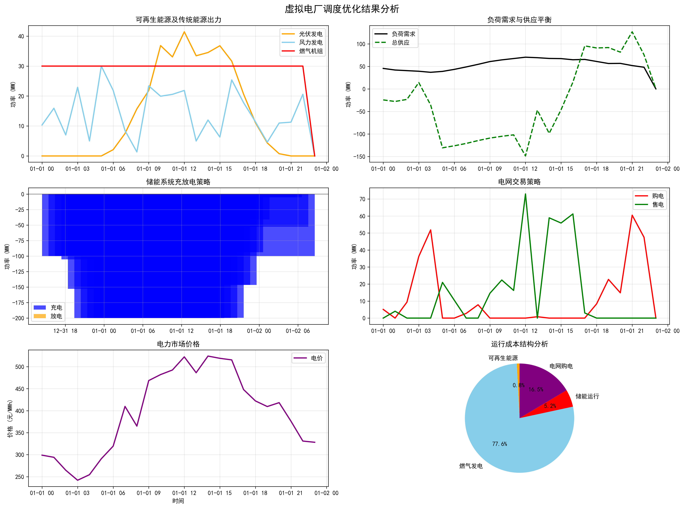

# 虚拟电厂调度优化系统 (VPP Optimization System)

基于 oemof-solph 构建的虚拟电厂多能源资源协调调度优化系统，采用 CBC 求解器进行线性规划优化。

---

## 🌟 系统效果预览


---

## 🎯 项目概述

本项目是一个完整的虚拟电厂调度优化解决方案，旨在为虚拟电厂提供智能化的能源资源调度策略，实现多类型能源资源的协调运行和成本最优化。系统集成了**源网荷储**一体化的现代能源管理理念，支持可再生能源、传统发电、储能系统、可调负荷和电网交互的协同优化。

## 注意！！！
本项目采用的数据都是通过数据生成方式的虚拟数据，如果需要替换成真实数据可以参考生成代码进行替换。

### 核心功能
- **多能源建模**: 光伏、风电、燃气机组、储能系统、可调负荷、电网交互
- **智能调度**: 基于线性规划的最优调度策略，实现成本最小化
- **需求响应**: 冷机、热机等可调负荷参与系统优化，提供需求侧灵活性
- **实时分析**: 完整的经济性和技术性能分析
- **可视化**: 丰富的图表和报告生成
- **配置化**: 灵活的YAML配置文件管理

### 最新特性 ✨
- ✅ **可调负荷**: 新增冷机和热机可调负荷，支持需求侧响应
- ✅ **经济优化**: 综合考虑发电成本、储能成本、可调负荷成本
- ✅ **智能可视化**: 自动检测系统组件，动态生成相应图表
- ✅ **完整报告**: 包含可调负荷分析的详细运行报告

## 🏗️ 系统架构

```
vpp_opt_test_qqder/
├── README.md                    # 项目文档
├── pyproject.toml              # 项目配置
├── main.py                     # 主程序入口
├── config/                     # 配置文件目录
│   ├── system_config.yaml     # 系统参数配置
│   └── solver_config.yaml     # 求解器配置
├── docs/                       # 项目文档
│   └── optimization_modeling.md # 优化建模详细说明
├── src/                        # 源代码目录
│   ├── __init__.py
│   ├── data/                   # 数据生成模块
│   │   ├── __init__.py
│   │   └── data_generator.py   # 负荷、光伏、风电、电价数据生成
│   ├── models/                 # 优化模型模块
│   │   ├── __init__.py
│   │   └── vpp_model.py        # oemof-solph能源系统建模
│   ├── solvers/                # 求解器模块
│   │   ├── __init__.py
│   │   └── optimization_solver.py # CBC求解器配置和优化求解
│   ├── analysis/               # 结果分析模块
│   │   ├── __init__.py
│   │   └── result_analyzer.py  # 经济性分析和性能指标计算
│   └── visualization/          # 可视化模块
│       ├── __init__.py
│       └── plot_generator.py   # 结果图表生成和报告
├── tests/                      # 测试文件
│   └── test_vpp_system.py     # 系统测试
├── examples/                   # 示例和演示
│   └── demo_optimization.py   # 简单演示
├── outputs/                    # 输出结果目录
│   ├── plots/                  # 图表输出
│   └── reports/                # 报告输出
├── logs/                       # 日志文件
├── cbc/                        # CBC求解器
│   └── bin/
│       └── cbc.exe            # CBC可执行文件
└── test_*.py                   # 功能测试脚本
```

## 🔧 技术栈

### 核心技术
- **优化引擎**: oemof-solph 0.5.0+ (开源能源系统建模框架)
- **求解器**: CBC (Coin-or Branch and Cut) 线性规划求解器
- **建模工具**: pyomo 6.6.0+ (数学建模语言)
- **数据处理**: pandas, numpy
- **可视化**: matplotlib, plotly
- **配置管理**: PyYAML
- **Python版本**: 3.12+

### 依赖包
```toml
oemof.solph>=0.5.0      # 能源系统建模
pyomo>=6.6.0            # 数学优化建模
psutil>=7.0.0           # 系统监控
PyYAML>=6.0             # 配置文件解析
scipy>=1.11.0           # 科学计算
matplotlib>=3.8.0       # 图表绘制
pandas>=2.1.0           # 数据分析
numpy>=1.26.0           # 数值计算
```

## 🚀 快速开始

### 1. 环境准备

```bash
# 克隆项目
git clone https://github.com/2308087369/Virtual-power-plants
cd vpp_opt_test_qqder

# 安装依赖（推荐使用uv）
uv pip install -e .

# 或使用pip
pip install -e .
```

### 2. 运行优化

```bash
# 运行完整的虚拟电厂优化演示
python main.py --demo

# 运行主程序（默认模式）
python main.py

# 查看帮助信息
python main.py --help
```

### 3. 测试功能

```bash
# 测试基本功能
python test_cbc.py

# 测试完整流程
python test_complete_flow.py

# 测试可调负荷功能
python test_adjustable_loads.py

# 运行单元测试
python tests/test_vpp_system.py
```

### 4. 配置自定义

编辑配置文件来自定义系统参数：

**系统配置** (`config/system_config.yaml`):
```yaml
# 能源资源容量配置
energy_resources:
  photovoltaic:
    capacity_mw: 50          # 光伏装机容量
  wind:
    capacity_mw: 30          # 风电装机容量
  gas_turbine:
    capacity_mw: 100         # 燃气机组容量
  battery_storage:
    power_capacity_mw: 50    # 储能功率容量
    energy_capacity_mwh: 200 # 储能能量容量

# 可调负荷配置
adjustable_loads:
  chiller:
    rated_power_mw: 20       # 冷机额定功率
    operating_cost_yuan_mwh: 50  # 运行成本
  heat_pump:
    rated_power_mw: 15       # 热机额定功率
    operating_cost_yuan_mwh: 40  # 运行成本
```

**求解器配置** (`config/solver_config.yaml`):
```yaml
cbc_options:
  threads: 4               # 使用线程数
  timeLimit: 300           # 求解时间限制(秒)
  ratioGap: 0.01          # 最优性间隙(1%)
```

## 📊 主要组件

### 1. 发电资源 ⚡

#### 可再生能源
- **光伏发电**: 50MW装机，日间出力，成本5元/MWh
- **风力发电**: 30MW装机，全天候运行，成本8元/MWh

#### 传统发电
- **燃气机组**: 100MW装机，最小出力30%，成本600元/MWh

### 2. 储能系统 🔋
- **功率容量**: 50MW (充电/放电)
- **能量容量**: 200MWh
- **往返效率**: 90.25% (充电95% × 放电95%)
- **响应速度**: 毫秒级快速响应

### 3. 可调负荷 🏭

#### 冷机系统
- **额定功率**: 20MW
- **调节范围**: 30%-100%
- **制冷效率**: 85%
- **响应时间**: 5分钟
- **运行成本**: 50元/MWh

#### 热机系统
- **额定功率**: 15MW  
- **调节范围**: 20%-100%
- **制热系数**: COP=3.5
- **响应时间**: 3分钟
- **运行成本**: 40元/MWh

### 4. 电网交互 🏗️
- **最大购电**: 1000MW
- **最大售电**: 500MW
- **售电价格**: 95%市场电价
- **双向调节**: 支持购售电灵活切换

## 🎯 优化目标与约束

### 优化目标
系统以**总运行成本最小化**为目标，综合优化：
```
min: 发电成本 + 储能成本 + 可调负荷成本 + 电网交易成本 - 售电收入
```

### 主要约束
1. **电力平衡约束**: 供需实时平衡
2. **设备容量约束**: 各设备运行在额定范围内
3. **储能SOC约束**: 储能荷电状态限制
4. **机组爬坡约束**: 燃气机组最小出力约束
5. **可调负荷约束**: 冷热机调节范围约束
6. **电网交易限制**: 购售电功率上限

### 📚 详细数学建模
> 📖 **完整的优化建模说明**: [优化建模文档](docs/optimization_modeling.md)
>
> 包含详细的目标函数、约束条件、决策变量等数学公式和建模方法说明。

## 📈 输出结果

### 调度策略输出
- ⚡ **发电计划**: 各时段光伏、风电、燃气机组出力
- 🔋 **储能策略**: 充放电功率和SOC变化
- 🏭 **负荷调节**: 冷机、热机功率调节策略
- 🔌 **电网交易**: 购售电计划和交易量

### 分析报告
- 📊 **经济性分析**: 成本结构、收益分析、投资回报
- 📈 **技术指标**: 可再生能源渗透率、自给自足率、设备利用率
- 📋 **运行报告**: 详细的系统运行总结和建议

### 可视化图表
- 📉 **发电资源出力曲线**
- ⚖️ **负荷与供应平衡图**
- 🔋 **储能充放电策略图**
- 🏭 **可调负荷运行状态图**
- 💰 **电价变化和成本结构图**

## 📊 典型运行结果

基于24小时优化调度的典型结果：

### 能源供需结构
- **总负荷需求**: 1,259.8 MWh
- **可再生能源发电**: 665.8 MWh (49.1%渗透率)
- **可调负荷参与**: 207.0 MWh (16.4%参与率)
- **自给自足率**: 100%

### 经济性表现
- **净运行成本**: 464,960元
- **平均供电成本**: 369.08元/MWh
- **可调负荷成本**: 9,660元
- **年化运行成本**: 约1.7亿元

### 系统性能
- **可再生能源利用率**: 高效消纳
- **储能系统效率**: 需优化调度策略
- **负荷响应能力**: 35MW可调容量
- **电网交易平衡**: 134.18 MWh净购电

## 📈 优化结果可视化

系统自动生成的优化调度结果图表，直观展示各能源资源的协调运行状态：

### 🔋 综合调度策略结果图



*图1：24小时虚拟电厂多能源资源协调调度结果展示，包含负荷需求、发电资源出力、储能运行状态和电网交互等关键信息*

### ⚡ 能源平衡与成本分析


*图2：能源供需平衡分析和经济性评估，展示可再生能源渗透、可调负荷参与和系统运行成本结构*

### 📊 关键技术指标

通过可视化结果可以清晰看到：
- **🌞 光伏发电**: 日间高效发电，峰值达到额定容量
- **💨 风力发电**: 全天候稳定出力，提供基础电力供应
- **⚡ 燃气机组**: 灵活调节，在可再生能源不足时及时补充
- **🔋 储能系统**: 削峰填谷，优化电力供需匹配
- **🏭 可调负荷**: 冷机和热机智能参与需求侧响应
- **🔌 电网交互**: 双向功率流，实现经济优化运行

> 💡 **提示**: 图表数据基于真实的优化算法计算结果，反映了虚拟电厂在实际运行中的调度策略和经济效益。

## 🔍 使用场景

### 适用领域
- 🏭 **工业园区**: 多能源协调调度和成本优化
- 🏢 **商业综合体**: 冷热电联供系统优化
- 🌆 **智慧城市**: 区域能源管理和需求响应
- ⚡ **电力市场**: 虚拟电厂聚合资源参与市场交易
- 🔬 **科研院所**: 能源系统优化算法研究

### 典型用户
- **虚拟电厂运营商**: 制定最优调度策略
- **能源管理系统开发者**: 算法验证和系统集成
- **电力市场参与者**: 交易策略制定和风险评估
- **工业用户**: 能源成本控制和需求侧管理

## 🛠️ 开发指南

### 扩展新的可调资源

1. **配置文件扩展**:
```yaml
# config/system_config.yaml
adjustable_loads:
  new_device:
    rated_power_mw: 10
    operating_cost_yuan_mwh: 30
```

2. **模型组件添加**:
```python
# src/models/vpp_model.py
def _create_adjustable_loads(self):
    # 添加新设备的建模逻辑
    new_device = solph.components.Sink(...)
```

3. **结果分析更新**:
```python
# src/analysis/result_analyzer.py
# 添加新设备的结果提取和分析
```

### 自定义优化目标

可以通过修改oemof-solph模型来实现不同的优化目标：
- 碳排放最小化
- 可再生能源利用率最大化
- 峰谷差最小化
- 多目标权衡优化

## ⚠️ 注意事项

### 系统要求
- **操作系统**: Windows 10+, Linux, macOS
- **Python版本**: 3.12或更高
- **内存**: 建议8GB以上
- **处理器**: 多核处理器，支持并行计算

### 求解器配置
- CBC求解器已包含在项目中 (`cbc/bin/cbc.exe`)
- 大规模问题建议使用商业求解器（Gurobi, CPLEX）
- 求解时间可通过配置文件调整

### 性能优化建议
- 适当调整时间段数量和模型复杂度
- 使用多线程求解提升性能
- 监控内存使用，避免内存不足

## 🐛 故障排除

### 常见问题

**1. CBC求解器找不到**
```bash
# 检查CBC路径
ls cbc/bin/cbc.exe

# 重新安装依赖
uv pip install -e .
```

**2. 求解失败**
- 检查数据有效性
- 调整求解器参数
- 查看日志文件 `logs/solver.log`

**3. 内存不足**
- 减少优化时间段
- 简化模型约束
- 增加虚拟内存

## 📝 许可证

MIT License - 详见 [LICENSE](LICENSE) 文件
