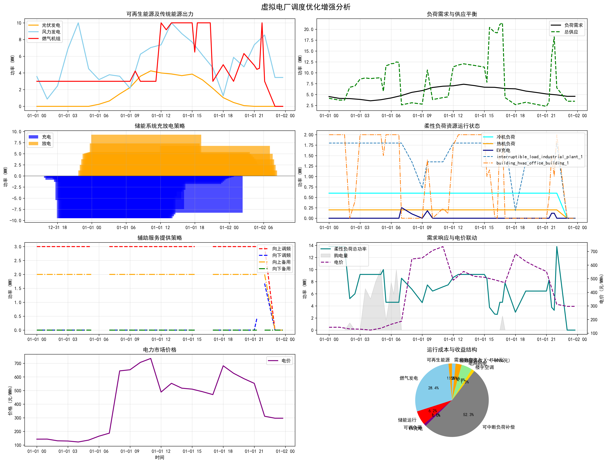
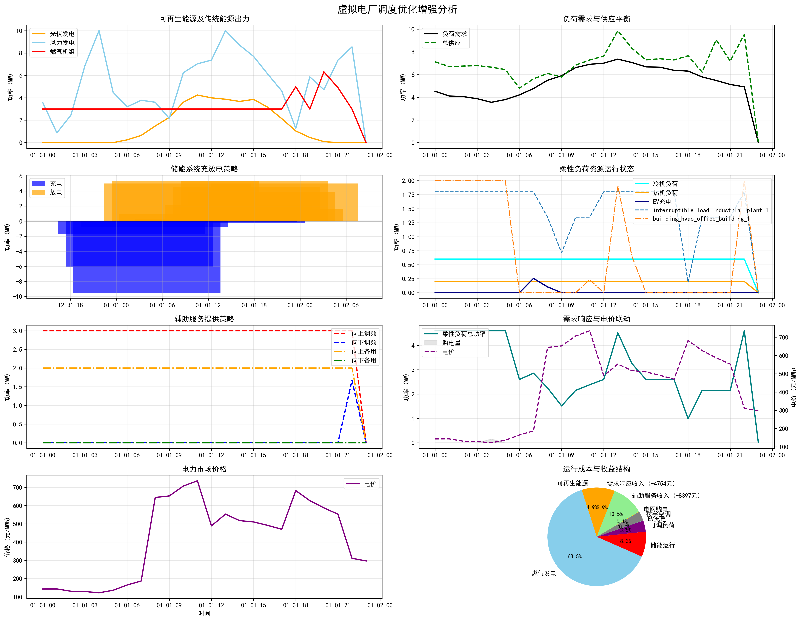
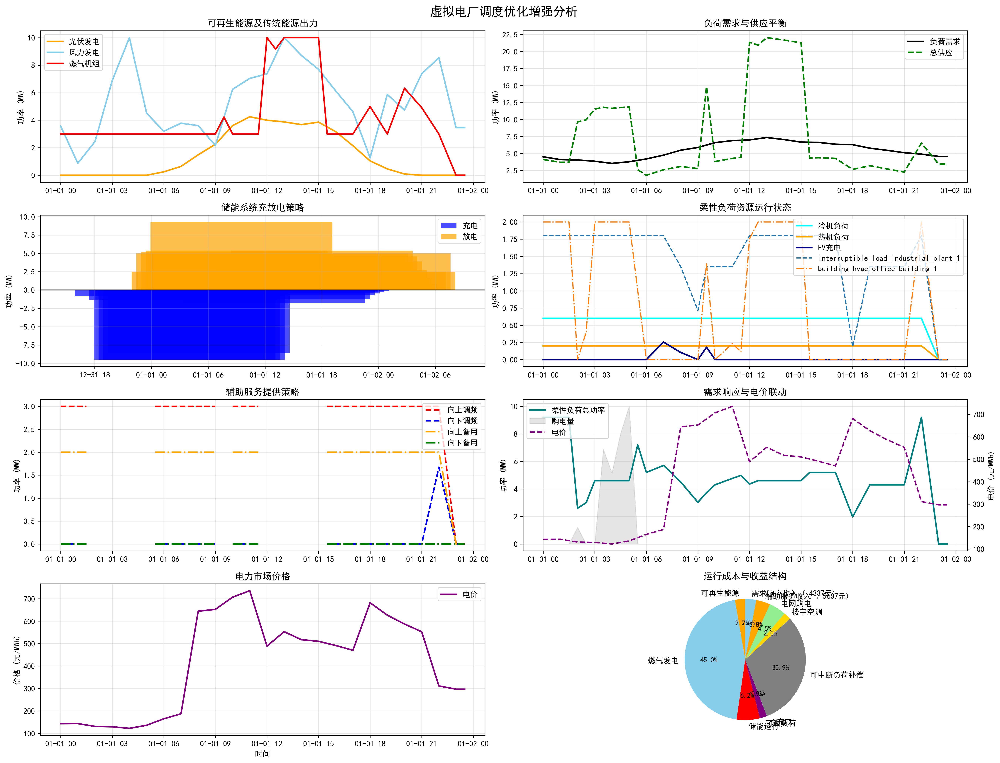

# 虚拟电厂调度优化系统 (VPP Optimization System)

**中文版** | [English](README.md)

基于 oemof-solph 构建的虚拟电厂多能源资源协调调度优化系统，采用 CBC 求解器进行线性规划优化。



## 🎯 项目概述

本项目为虚拟电厂提供智能化的能源资源调度策略，实现多类型能源资源的协调运行和成本最优化，支持可再生能源、传统发电、储能系统、可调负荷和电网交互的协同优化。

**注意**: 本项目采用数据生成方式的虚拟数据，如需替换真实数据可参考生成代码进行替换。

### 核心功能
- **多能源建模**: 光伏、风电、燃气机组、储能系统、可调负荷、电网交互
- **六种调度模式**: renewable_storage、adjustable_storage、traditional、no_renewable、storage_only、full_system
- **多目标优化**: 成本最小化和利润最大化
- **辅助服务**: 储能系统参与调频和旋转备用服务
- **需求响应**: 冷机、热机等可调负荷参与系统优化
- **分层调度**: 支持“日前-日内-实时”三级滚动执行
- **分离式储能建模**: Converter + GenericStorage 架构确保物理约束
- **交互式界面**: 友好的模式选择和优化目标选择界面

## 🚀 快速开始

### 环境准备
```bash
# 克隆项目
git clone https://github.com/2308087369/Virtual-power-plants
cd vpp_opt_test_qqder

# 安装依赖（推荐使用uv）
uv pip install -e .

# 或使用pip
pip install -e .
```

### 运行优化
```bash
# 交互式模式（推荐）
python main.py

# 指定分层调度模式
python main.py --mode full_system --objective cost_minimization

# 对比所有模式
python main.py --compare-all

# 列出可用模式
python main.py --list-modes
```

### 测试功能
```bash
# 运行所有测试
python tests/run_tests.py

# 运行特定测试类别
python tests/run_tests.py --type basic        # 基本功能测试
python tests/run_tests.py --type cbc          # CBC求解器测试
python tests/run_tests.py --type scheduling   # 调度模式测试
python tests/run_tests.py --type objectives   # 优化目标测试
python tests/run_tests.py --test roadmap      # 路线图与分层调度验证
```

## 🔧 配置说明

编辑配置文件自定义系统参数：

**系统配置** (`config/system_config.yaml`):
- 能源资源容量和成本参数
- 储能系统参数 (10MW/40MWh)
- 可调负荷设置
- 辅助服务参数

**求解器配置** (`config/solver_config.yaml`):
- CBC求解器设置（线程数、时间限制、最优性间隙）

## 📊 系统组件

### 发电资源
- **光伏发电**: 50MW装机，5元/MWh成本
- **风力发电**: 30MW装机，8元/MWh成本
- **燃气机组**: 100MW装机，600元/MWh成本

### 储能系统
- **功率容量**: 10MW (充放电功率)
- **能量容量**: 40MWh (4小时储能)
- **效率**: 充电95%，放电93%
- **SOC范围**: 10%-95%
- **约束**: 分离式建模确保充放电互斥

### 可调负荷
- **冷机系统**: 20MW额定功率，30%-100%调节范围
- **热机系统**: 15MW额定功率，20%-100%调节范围

## 优化目标

1. **成本最小化**: 最小化总运行成本
2. **利润最大化**: 最大化总利润（售电收入+辅助服务收入-所有成本）

## 输出结构

结果保存在 `outputs/{mode}_{objective}_{timestamp}/`:
- `data/`: 基础输入与多时间尺度输入数据
- `results/`: 日前、日内、实时调度结果
- `economics/`: 各阶段经济性分析
- `metrics/`: 阶段技术指标、场景汇总和分层阶段汇总
- `reports/`: 阶段报告和总报告 `hierarchical_dispatch_report.txt`
- `plots/`: 日前、日内、实时可视化图表

## 系统架构

```
vpp_opt_test_qqder/
├── src/                        # 核心模块
│   ├── data/                   # 数据生成
│   ├── models/                 # 优化建模
│   ├── solvers/                # CBC求解器集成
│   ├── analysis/               # 结果分析
│   └── visualization/          # 图表生成
├── config/                     # 配置文件
├── tests/                      # 测试套件
└── outputs/                    # 结果输出
```

## 关键技术亮点

**分离式储能建模**: 通过Converter + GenericStorage架构解决传统GenericStorage约束失效问题，确保：
- 零同时充放电时段
- 功率限制严格执行（≤10MW）
- 物理约束合规性
- 调度结果可执行性

## 最新分层调度结果

最新 `full_system` 成本最小化实验：
- **运行命令**: `python main.py --mode full_system --objective cost_minimization`
- **结果目录**: `outputs/full_system_cost_minimization_20260529_095947/`
- **场景汇总**: 生成了 5 个不确定性场景，平均电价范围为 `415.07-428.22` 元/MWh

### 阶段汇总

| 阶段 | 时间步数 | 净成本（元） | 平均成本（元/MWh） | 负荷电量（MWh） | 可再生渗透率 | 最终SOC |
|---|---:|---:|---:|---:|---:|---:|
| 日前调度 | 24 | -76,490.75 | -604.21 | 126.60 | 67.93% | 0.0000 |
| 日内滚动调度 | 48 | -51,139.96 | -389.80 | 131.20 | 62.20% | 0.0065 |
| 实时滚动调度 | 96 | -15,631.36 | -119.14 | 131.20 | 59.53% | 0.0020 |

### 滚动执行说明
- **日内阶段**: 共 48 个滚动窗口，早晨与下午部分窗口成功优化，其余不可行窗口采用上一层基线回退
- **实时阶段**: 共 96 个滚动窗口，优化主要集中在 `05:30-06:45`、`15:30-16:45` 和 `21:30-21:45`
- **工程含义**: 当前分层流程已经可以完整执行，但在短时滚动窗口下，局部约束仍可能触发基线回退

### 最新可视化

日前调度图：



日内滚动调度图：



实时滚动调度图：


### 最新结果文件
- 阶段汇总: [hierarchical_stage_summary.csv](file:///d:/py_work/vpp_opt_test_qqder/outputs/full_system_cost_minimization_20260529_095947/metrics/hierarchical_stage_summary.csv)
- 总报告: [hierarchical_dispatch_report.txt](file:///d:/py_work/vpp_opt_test_qqder/outputs/full_system_cost_minimization_20260529_095947/reports/hierarchical_dispatch_report.txt)
- 日内窗口明细: [intraday_rolling_windows.csv](file:///d:/py_work/vpp_opt_test_qqder/outputs/full_system_cost_minimization_20260529_095947/results/intraday_rolling_windows.csv)
- 实时窗口明细: [realtime_rolling_windows.csv](file:///d:/py_work/vpp_opt_test_qqder/outputs/full_system_cost_minimization_20260529_095947/results/realtime_rolling_windows.csv)

## 技术栈

- **优化引擎**: oemof-solph 0.6.0 + CBC求解器
- **建模工具**: pyomo 6.6.0+
- **数据处理**: pandas, numpy
- **可视化**: matplotlib
- **配置管理**: PyYAML
- **Python版本**: 3.12+

## 许可证

MIT License - 详见 [LICENSE](LICENSE) 文件
### 示例
- 微电网优化示例（含完整可视化与报告）：
  - 脚本：`examples/optimization_microgrid_complete.py`
  - 说明（中文）：`examples/readme.md`
  - 说明（英文）：`examples/readme_en.md`
  - 结果目录：`examples/microgrid_results/`
