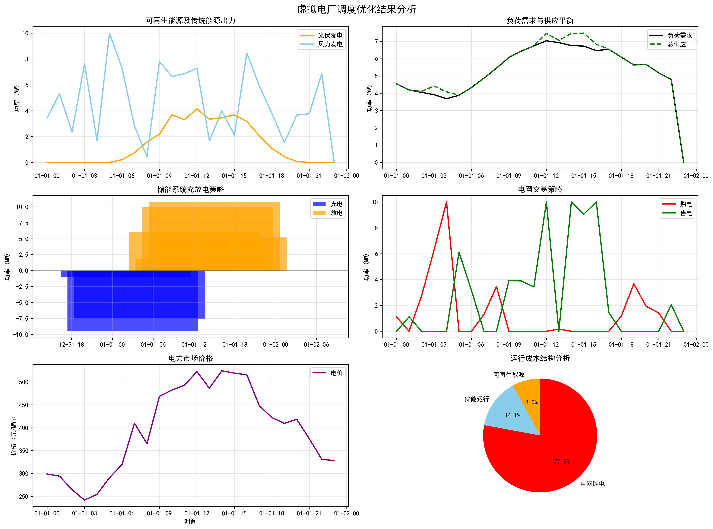

# 虚拟电厂调度优化系统 (VPP Optimization System)

**中文版** | [English](README.md)

基于 oemof-solph 构建的虚拟电厂多能源资源协调调度优化系统，采用 CBC 求解器进行线性规划优化。



## 🎯 项目概述

本项目为虚拟电厂提供智能化的能源资源调度策略，实现多类型能源资源的协调运行和成本最优化，支持可再生能源、传统发电、储能系统、可调负荷和电网交互的协同优化。

**注意**: 本项目采用数据生成方式的虚拟数据，如需替换真实数据可参考生成代码进行替换。

### 核心功能
- **多能源建模**: 光伏、风电、燃气机组、储能系统、可调负荷、电网交互
- **六种调度模式**: renewable_storage、adjustable_storage、traditional、no_renewable、storage_only、full_system
- **多目标优化**: 成本最小化和利润最大化
- **辅助服务**: 储能系统参与调频和旋转备用服务
- **需求响应**: 冷机、热机等可调负荷参与系统优化
- **分离式储能建模**: Converter + GenericStorage 架构确保物理约束
- **交互式界面**: 友好的模式选择和优化目标选择界面

## 🚀 快速开始

### 环境准备
```bash
# 克隆项目
git clone https://github.com/2308087369/Virtual-power-plants
cd vpp_opt_test_qqder

# 安装依赖（推荐使用uv）
uv pip install -e .

# 或使用pip
pip install -e .
```

### 运行优化
```bash
# 交互式模式（推荐）
python main.py

# 演示模式
python main.py --demo

# 指定调度模式
python main.py --mode=full_system

# 对比所有模式
python main.py --compare-all

# 列出可用模式
python main.py --list-modes
```

### 测试功能
```bash
# 运行所有测试
python tests/run_tests.py

# 运行特定测试类别
python tests/run_tests.py --type basic        # 基本功能测试
python tests/run_tests.py --type cbc          # CBC求解器测试
python tests/run_tests.py --type scheduling   # 调度模式测试
python tests/run_tests.py --type objectives   # 优化目标测试
```

## 🔧 配置说明

编辑配置文件自定义系统参数：

**系统配置** (`config/system_config.yaml`):
- 能源资源容量和成本参数
- 储能系统参数 (10MW/40MWh)
- 可调负荷设置
- 辅助服务参数

**求解器配置** (`config/solver_config.yaml`):
- CBC求解器设置（线程数、时间限制、最优性间隙）

## 📊 系统组件

### 发电资源
- **光伏发电**: 50MW装机，5元/MWh成本
- **风力发电**: 30MW装机，8元/MWh成本
- **燃气机组**: 100MW装机，600元/MWh成本

### 储能系统
- **功率容量**: 10MW (充放电功率)
- **能量容量**: 40MWh (4小时储能)
- **效率**: 充电95%，放电93%
- **SOC范围**: 10%-95%
- **约束**: 分离式建模确保充放电互斥

### 可调负荷
- **冷机系统**: 20MW额定功率，30%-100%调节范围
- **热机系统**: 15MW额定功率，20%-100%调节范围

## 🎯 优化目标

1. **成本最小化**: 最小化总运行成本
2. **利润最大化**: 最大化总利润（售电收入+辅助服务收入-所有成本）

## 📁 输出结构

结果保存在 `outputs/{mode}_{objective}_{timestamp}/`:
- `optimization_results.csv`: 详细调度结果
- `economics_analysis.csv`: 经济性分析（含辅助服务收益）
- `technical_metrics.csv`: 技术指标统计
- `summary_report.txt`: 运行总结报告
- `optimization_results.png`: 可视化图表

## 🏗️ 系统架构

```
vpp_opt_test_qqder/
├── src/                        # 核心模块
│   ├── data/                   # 数据生成
│   ├── models/                 # 优化建模
│   ├── solvers/                # CBC求解器集成
│   ├── analysis/               # 结果分析
│   └── visualization/          # 图表生成
├── config/                     # 配置文件
├── tests/                      # 测试套件
└── outputs/                    # 结果输出
```

## 🔍 关键技术亮点

**分离式储能建模**: 通过Converter + GenericStorage架构解决传统GenericStorage约束失效问题，确保：
- 零同时充放电时段
- 功率限制严格执行（≤10MW）
- 物理约束合规性
- 调度结果可执行性

## 📈 典型运行结果

基于24小时优化调度：
- **可再生能源渗透率**: 49.1%
- **辅助服务收入**: 49,450元/天
- **最优模式**: renewable_storage（最具盈利性）
- **储能套利**: 有效的削峰填谷

## 🛠️ 技术栈

- **优化引擎**: oemof-solph 0.6.0 + CBC求解器
- **建模工具**: pyomo 6.6.0+
- **数据处理**: pandas, numpy
- **可视化**: matplotlib
- **配置管理**: PyYAML
- **Python版本**: 3.12+

## 📄 许可证

MIT License - 详见 [LICENSE](LICENSE) 文件