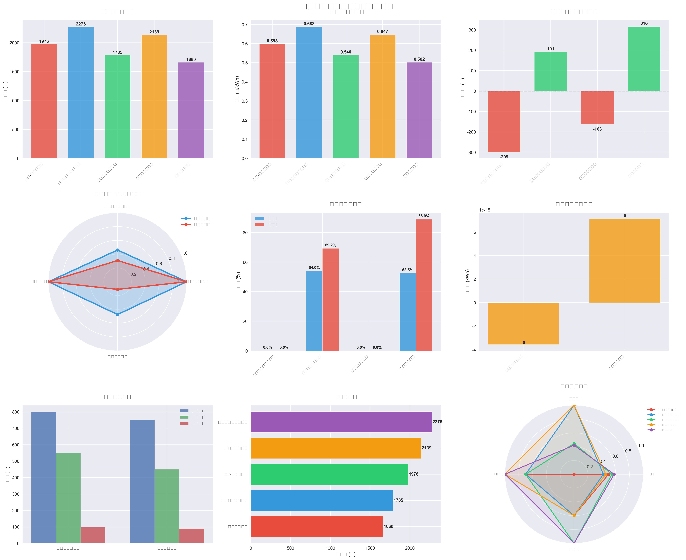
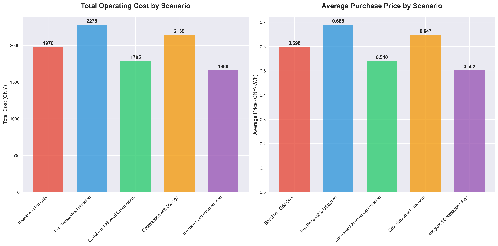
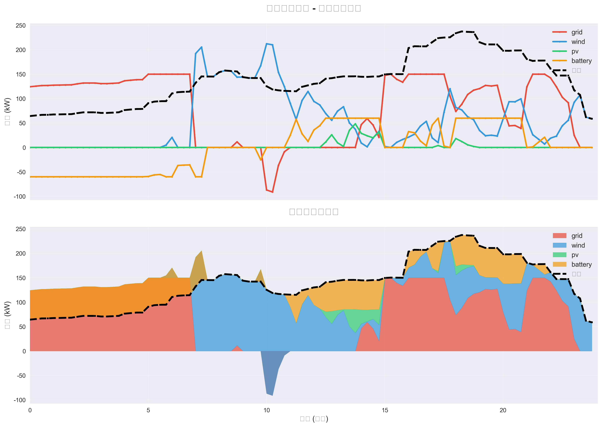
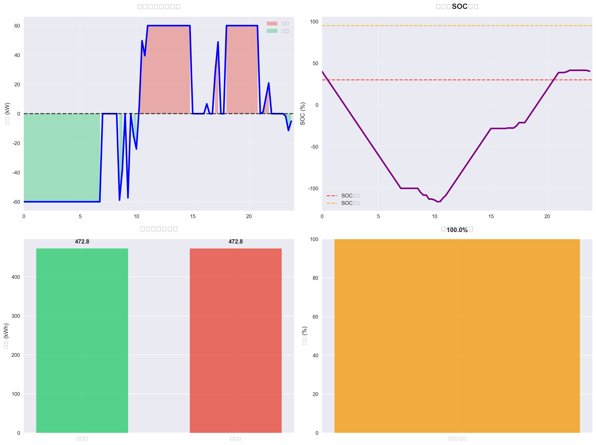
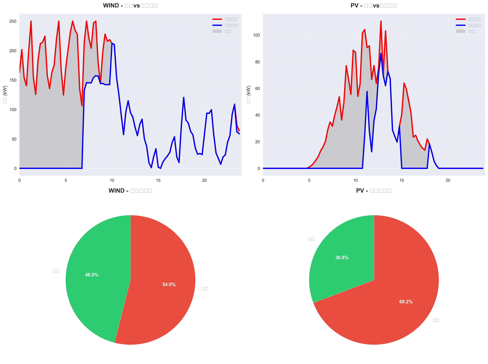
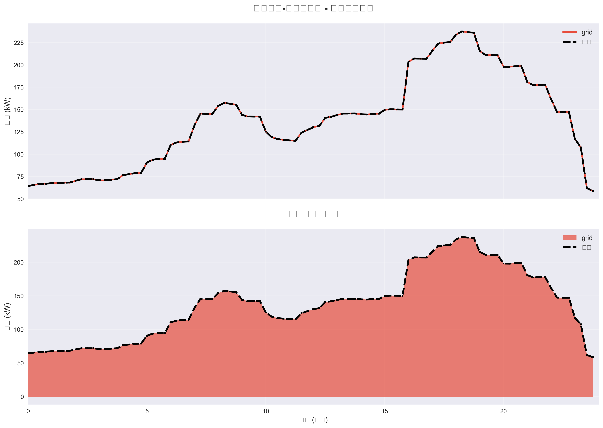

# 微电网优化示例说明

该示例参考“中国电机工程学会杯”中的微电网日内调度赛题，构建了一个可运行且可视化完整的微电网优化系统，用于对未来一天进行调度优化。

这个场景与虚拟电厂（VPP）具有内在联系：在社区虚拟电厂中，往往存在一个或多个微电网，为虚拟电厂提供负荷调节能力与灾后恢复能力。微电网包含如下核心要素：
- 微电网控制器：协调不同组件的运行，包括电池、储能系统、并网单元等。
- 微电网负载：需要满足的负荷需求，包含居民/企业负荷等。
- 微电网组件：电池/储能/并网单元等，用于存储/释放电能与调度协同。

---

## 快速开始
- 运行脚本：`python examples/optimization_microgrid_complete.py`
- 输入文件：`examples/input.csv`
  - 列含义（按顺序）：`Time,Load,Wind,PV,SellPrice,BuyPrice`
  - 时间分辨率：15分钟，共 96 点（24 小时）
- 结果目录：`examples/microgrid_results`

---

## 主要输出说明（含结果图）
生成的结果文件均位于 `examples/microgrid_results`，包括：
- 调度图：`power_scheduling_*`（各场景电源出力与负荷对比）
- 可再生利用图：`renewable_utilization_*`（风/光的预测与实际出力、弃电情况）
- 储能分析图：`storage_analysis_*`（SOC、充放电功率与循环统计）
- 成本对比图：`overall_cost_comparison.png`（各场景总成本对比）
- 综合看板：`comprehensive_dashboard.png`（核心指标总览）
- 结果总结：`optimization_summary.json`
- 文本报告：`cost_analysis_report.txt`、`executive_summary.txt`

示例图（以下为关键图像引用）：
- 综合看板：
  - `microgrid_results/comprehensive_dashboard.png`
  - 
- 成本对比：
  - `microgrid_results/overall_cost_comparison.png`
  - 
- 场景5（综合优化方案）调度：
  - `microgrid_results/power_scheduling_05_综合优化方案.png`
  - 
- 场景4（含储能）储能分析：
  - `microgrid_results/storage_analysis_04_含储能系统优化.png`
  - 
- 场景3（允许弃风弃光）可再生利用：
  - `microgrid_results/renewable_utilization_03_允许弃风弃光优化.png`
  - 
- 场景1（仅电网供电）调度：
  - `microgrid_results/power_scheduling_01_基准场景-仅电网供电.png`
  - 

---

## 场景设置与含义
脚本会自动生成并求解以下 5 个运营场景，并将各场景结果分别保存：
- 场景1：基准场景（仅电网供电）
- 场景2：可再生能源全额利用（风/光尽可能用）
- 场景3：允许弃风弃光优化（在成本最优前提下允许一定弃电）
- 场景4：含储能系统优化（引入储能进行移峰填谷）
- 场景5：综合优化方案（风/光/储能/电网协同最优）

> 每个场景的优化日志位于：`microgrid_results/optimization_log_*.txt`

---

## 运行注意事项
- 请确保在项目根目录运行脚本或直接指定完整路径：`python examples/optimization_microgrid_complete.py`
- Windows 路径请避免反斜杠触发的转义问题（如 `\v`）：脚本内部已统一使用 `pathlib.Path` 构造相对路径以确保稳健性。

---

## 文件说明
- `examples/optimization_microgrid_complete.py`：完整的微电网优化示例脚本，包含模型、求解、可视化与报告生成。
- `examples/input.csv`：输入数据，包括未来 24h 的负荷(kW)、风机(kW)、光伏(kW)、售电(元/kWh)、购电(元/kWh)。
- `examples/microgrid_results/`：输出目录，包含各场景图像与报告文件。