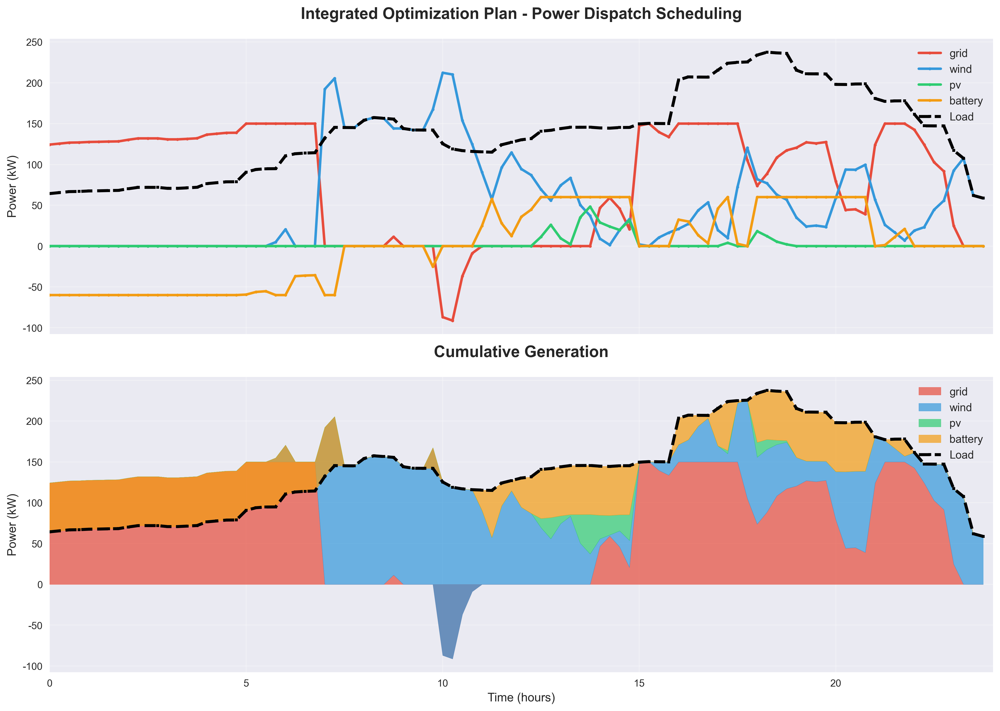
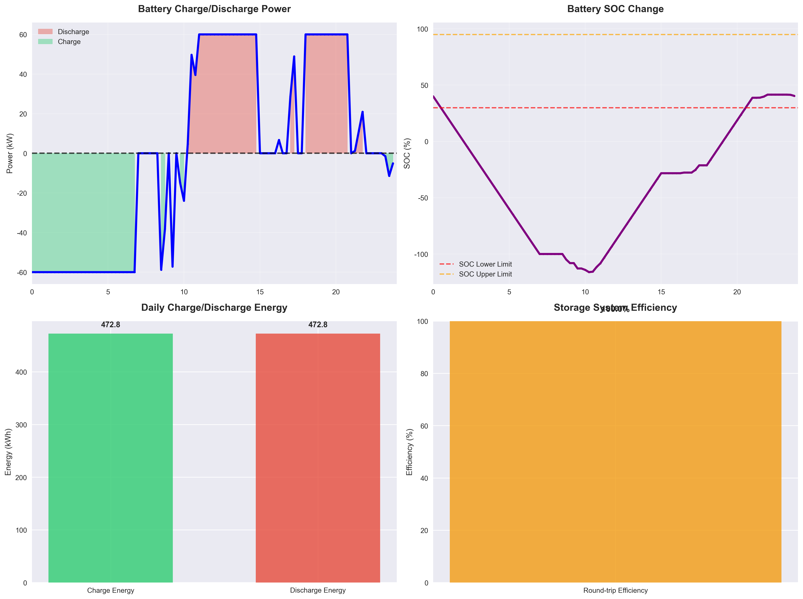
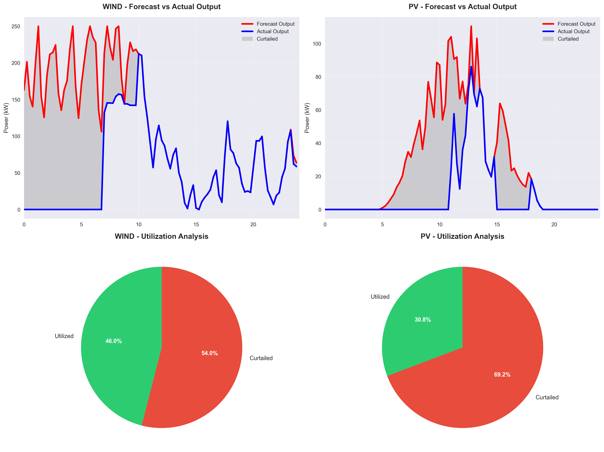
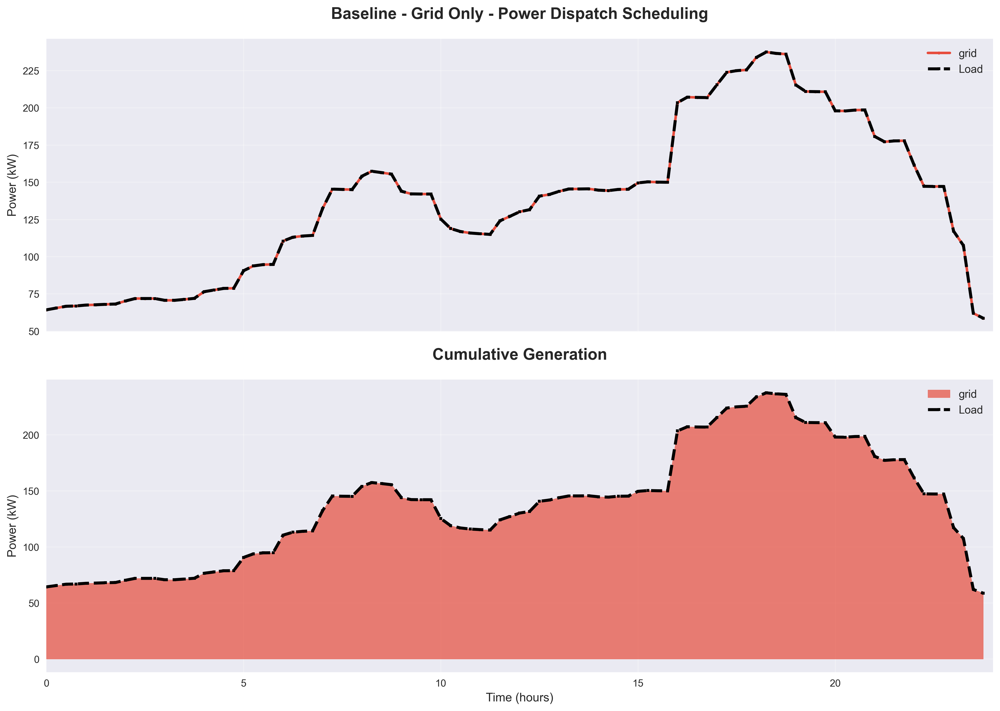

# Microgrid Optimization Example

Language: [中文文档](readme.md)

This example follows a day-ahead microgrid scheduling problem and builds a fully runnable and visualized optimization system to optimize operations for the next 24 hours.

The scenario is closely related to Virtual Power Plants (VPP). In community VPPs, one or more microgrids often provide flexibility for load shifting and resilience. Key components include:
- Microgrid controller: orchestrates operations across batteries, storage systems, and grid interface units.
- Microgrid loads: demand to be met, including residential and commercial loads.
- Microgrid assets: batteries/storage/grid interface units for energy storage, dispatch, and coordination.

---

## Quick Start
- Run script: `python examples/optimization_microgrid_complete.py`
- Input file: `examples/input.csv`
  - Columns (in order): `Time,Load,Wind,PV,SellPrice,BuyPrice`
  - Time resolution: 15 minutes, 96 points in total (24 hours)
- Results directory: `examples/microgrid_results`

---

## Outputs (with figures)
All outputs are saved under `examples/microgrid_results`, including:
- Scheduling plots: `power_scheduling_*` (power outputs vs. load across scenarios)
- Renewable utilization: `renewable_utilization_*` (forecast vs. actual, curtailment)
- Storage analysis: `storage_analysis_*` (SOC, charge/discharge power, cycle stats)
- Cost comparison: `overall_cost_comparison.png` (total cost across scenarios)
- Executive dashboard: `comprehensive_dashboard.png`
- Summary JSON: `optimization_summary.json`
- Text reports: `cost_analysis_report.txt`, `executive_summary.txt`

Sample figures:
- Executive Dashboard:
  - `microgrid_results/comprehensive_dashboard.png`
  - 
- Cost Comparison:
  - `microgrid_results/overall_cost_comparison.png`
  - 
- Scenario 5 (Comprehensive Optimization) Scheduling:
  - `microgrid_results/power_scheduling_05_Integrated_Optimization_Plan.png`
  - 
- Scenario 4 (With Storage) Analysis:
  - `microgrid_results/storage_analysis_04_Optimization_with_Storage.png`
  - 
- Scenario 3 (Curtailment Allowed) Renewable Utilization:
  - `microgrid_results/renewable_utilization_03_Curtailment_Allowed_Optimization.png`
  - 
- Scenario 1 (Grid Only) Scheduling:
  - `microgrid_results/power_scheduling_01_Baseline___Grid_Only.png`
  - 

---

## Scenarios
The script will generate and solve the following five scenarios:
- Scenario 1: Baseline (grid-only supply)
- Scenario 2: Full utilization of renewables (use wind/PV as much as possible)
- Scenario 3: Optimization with allowed curtailment (min-cost with controlled curtailment)
- Scenario 4: Optimization with storage (peak-shaving with storage)
- Scenario 5: Comprehensive optimization (co-optimization of wind/PV/storage/grid)

> Optimization logs per scenario: `microgrid_results/optimization_log_*.txt`

---

## Notes
- Run from the project root or specify the full path: `python examples/optimization_microgrid_complete.py`
- Windows path escaping (like `\v`) can break hard-coded paths. The script internally uses `pathlib.Path` to construct robust relative paths.

---

## Files
- `examples/optimization_microgrid_complete.py`: complete microgrid optimization example with modeling, solving, visualization, and reporting.
- `examples/input.csv`: input data for 24h including load(kW), wind(kW), PV(kW), sell price(¥/kWh), buy price(¥/kWh).
- `examples/microgrid_results/`: output directory containing scenario figures and reports.